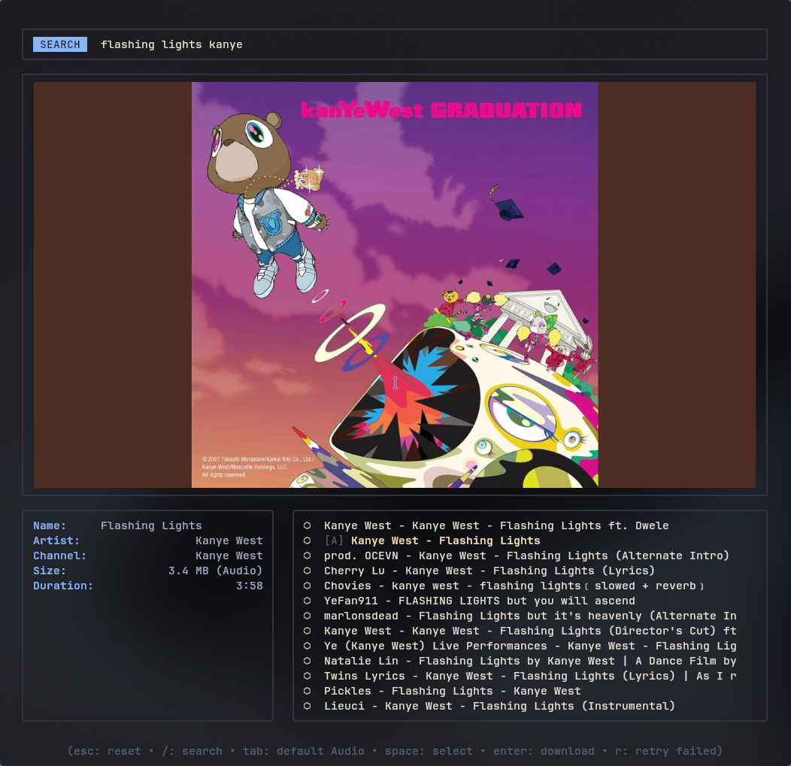
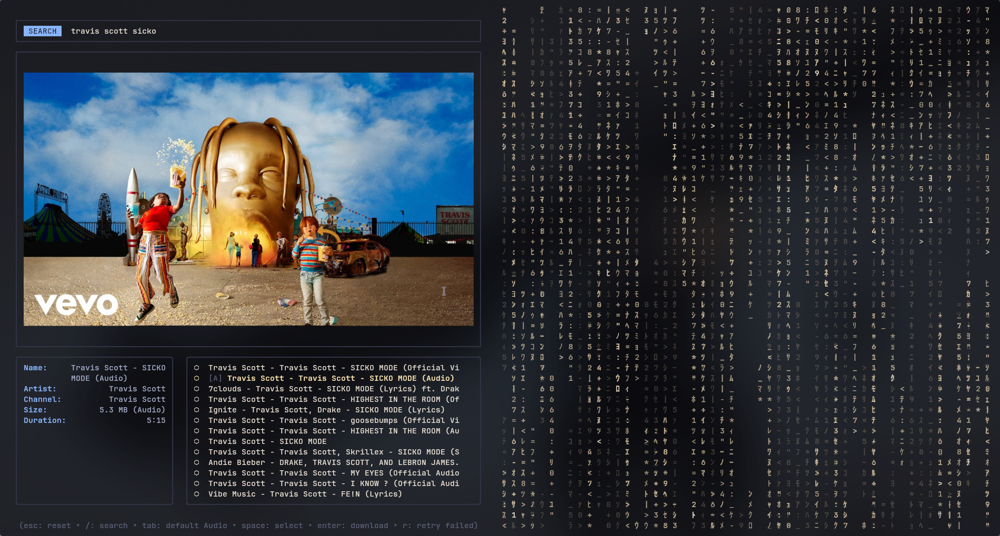

# yt-media

A terminal UI wrapper around [`yt-dlp`](https://github.com/yt-dlp/yt-dlp) for downloading audio or video from YouTube without ever leaving the terminal or pasting the same link into a browser tab. Built with [Bubble Tea](https://github.com/charmbracelet/bubbletea) and [Lip Gloss](https://github.com/charmbracelet/lipgloss).

Search by name, paste a raw video URL, preview the thumbnail in full quality (if you're on [Kitty](https://sw.kovidgoyal.net/kitty/)), select one or many results, and queue them for concurrent download — organized into your Music/Videos folders automatically.

## Demo

| Search & preview                        | Downloading                      |
| --------------------------------------- | -------------------------------- |
|  |  |

## Features

- **Search or paste** — type a query to search YouTube, or paste a full video URL directly and it's fetched as a single item instead of a search.
- **Real image previews** — thumbnails render as actual high-resolution images via the Kitty graphics protocol when available, falling back to ANSI half-block art on any other terminal.
- **Batch downloads** — select multiple results (`space`) and download them concurrently, with a configurable worker pool.
- **Skip what you already have** — downloads are tracked in a yt-dlp archive file by video ID, so re-running a search you've already downloaded from won't re-fetch anything.
- **Retry failed downloads** — one keypress (`r`) resets and re-queues anything that failed, no need to redo the whole batch.
- **Desktop notifications** — get notified when a _batch_ finishes (configurable threshold; single downloads don't spam you).
- **Config file, not recompiling** — worker count, default download type, output folders, notification behavior, and more all live in one JSON file.

## Requirements

- [Go](https://go.dev/) 1.22+ (build-time only)
- [`yt-dlp`](https://github.com/yt-dlp/yt-dlp) on your `PATH`
- [`ffmpeg`](https://ffmpeg.org/) (used by yt-dlp for audio extraction/embedding)
- Optional: [Kitty terminal](https://sw.kovidgoyal.net/kitty/) for high-resolution thumbnail previews (any other terminal falls back to ANSI art automatically)
- Optional: `notify-send` (Linux) or `osascript` (macOS, built-in) for batch-completion notifications

## Installation

```sh
git clone https://github.com/<your-username>/yt-media.git
cd yt-media
go build -o yt-media ./cmd/yt-dl
./yt-media
```

## Configuration

On first run, a default config is written to:

```
~/.config/yt-media/config.json
```

```jsonc
{
  // Number of simultaneous yt-dlp downloads.
  "max_workers": 3,

  // "Audio" or "Video" — the default selected on startup.
  "default_download_type": "Audio",

  // How many results to fetch per search.
  "search_result_limit": 15,

  // Override where files land. Leave blank for ~/Music and ~/Videos.
  "music_dir": "",
  "video_dir": "",

  // Leave blank to use the default location alongside this config file.
  "archive_file": "",

  // Points to shrink the Kitty font by while running, for sharper
  // thumbnails. 0 disables this entirely.
  "font_shrink_delta": 1.5,

  // Desktop notification when a download queue finishes. Only fires for
  // batches (queue size >= notify_min_items), never single downloads.
  "notify_on_batch": true,
  "notify_min_items": 2,
}
```

Edit it and restart — no rebuild required.

### Higher-resolution previews via Kitty font shrinking (optional)

Kitty renders thumbnails at real pixel resolution rather than ANSI blocks, but resolution is still bounded by how many physical pixels each terminal cell covers — smaller font, more pixels per cell, sharper image (at the cost of smaller UI text everywhere, since font size is a whole-window property). To enable this:

1. In `~/.config/kitty/kitty.conf`, add:

   ```
   allow_remote_control socket-only
   ```

   and reload Kitty's config.

2. Set `font_shrink_delta` in your config to something above `0` (try `1.5`–`3`).

This is entirely optional — leaving it at `0` (or not enabling remote control) just means thumbnails render at your terminal's normal cell density.

## Keybindings

| Key              | Action                                                         |
| ---------------- | -------------------------------------------------------------- |
| `/`              | Start a search (type a query, or paste a YouTube URL)          |
| `↑`/`k`, `↓`/`j` | Move selection (wraps around the list)                         |
| `space`          | Toggle selection on the current item                           |
| `tab`            | Toggle default download type (Audio/Video)                     |
| `enter`          | Download selected items (or the current item if none selected) |
| `r`              | Retry any failed downloads in the current queue                |
| `esc`            | Reset search/selection                                         |
| `q` / `ctrl+c`   | Quit                                                           |

## How it works

- Searches go through `yt-dlp --dump-json --flat-playlist ytsearch<N>:<query>`; pasted URLs skip straight to a single-item metadata fetch.
- Thumbnails are cached locally (`~/.cache/yt-media/thumbs`) during a session and cleared on exit.
- Downloads run through `yt-dlp` directly — audio is extracted to MP3, video keeps the best available audio+video streams — with metadata and thumbnails embedded automatically.
- A yt-dlp `--download-archive` file tracks completed video IDs so repeat searches don't redownload existing files.

## License

MIT
